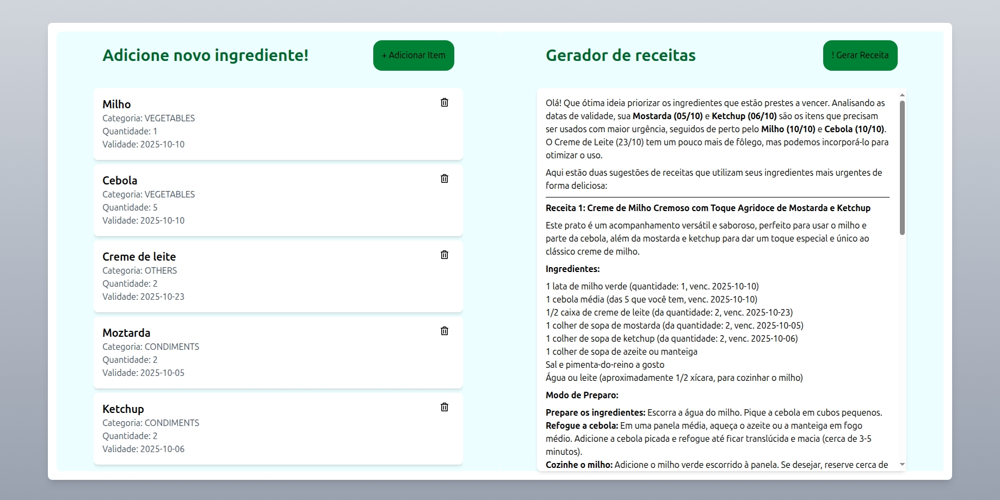

# MagicFrigdeAI - Aplicação Frontend

Este projeto é um simples simples protótipo de um Gerador de receitas, servindo como interface da minha [API](https://github.com/Braian-Zignago/MagicFridgeAI). A aplicação foi desenvolvida usando **React, Typescript e React Query**.

<h1 align="center">
    
</h1>

---
## Tecnologias Utilizada
	
  
  
  
  
  
  
---


## 💻 Requisitos

Antes de iniciar, você deve ter o Node.js e o NPM instalados em sua máquina.

## 🚀 Instalando

Primeiro, você deve clonar o projeto na sua máquina, para isso você
pode colar o seguinte comando em seu terminal

```bash
git clone git@github.com:Braian-Zignago/MagicFridgeAI-Front.git
cd MagicFridgeAI-Front
```

Para instalar as dependências, execute o seguinte comando:

```bash
npm install
```

Por fim, para executar o projeto basta rodar o seguinte:

```bash
npm run dev
```

## 🔧 Compilação

Para compilar a aplicação para produção, execute o seguinte comando:

```bash
npm run build
```
Isso irá gerar uma versão otimizada da aplicação na pasta `dist`.

## 🫂 Integração com Backend

Para realizar a integração com o Backend, você pode clonar o projeto e rodar localmente.

👉 [Link do repositório](https://github.com/Braian-Zignago/MagicFridgeAI)